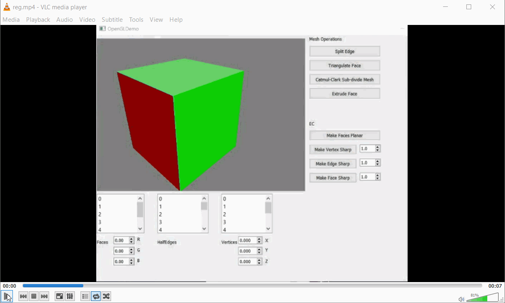
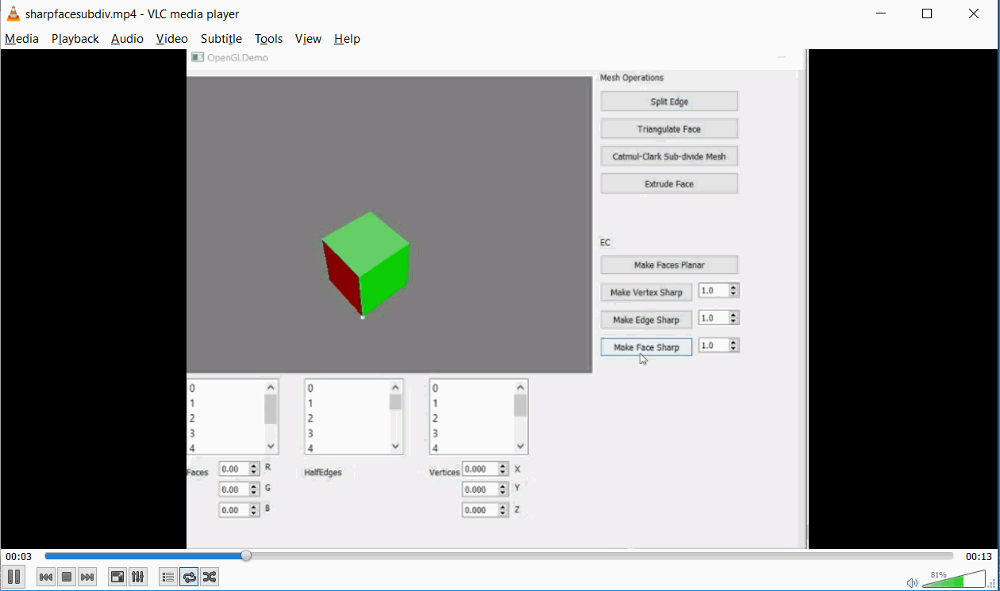

**University of Pennsylvania, CIS 560: Intro to Computer Graphics
Project 6 - From scratch implementations of Half Edge data structure, manipulations, and Catmul-Clark Subdivision

* Josh Lawrence

**Catmul-Clark subdivision of Half Edge data structure** 
* Low Quality GIF:

**Face Triangulation, extrusion and catmul-clark subdivision** 
* [Half Edge Manipulation then Subdivision video link](https://vimeo.com/240084111)
* Low Quality GIF:

**Sharpness with Subdivision** 
* [Sharpness with Subdivision video link](https://vimeo.com/240084108)
* Low Quality GIF:

### Credits

* [tinyobjloader](https://github.com/syoyo/tinyobjloader) by [@soyoyo](https://github.com/syoyo)

